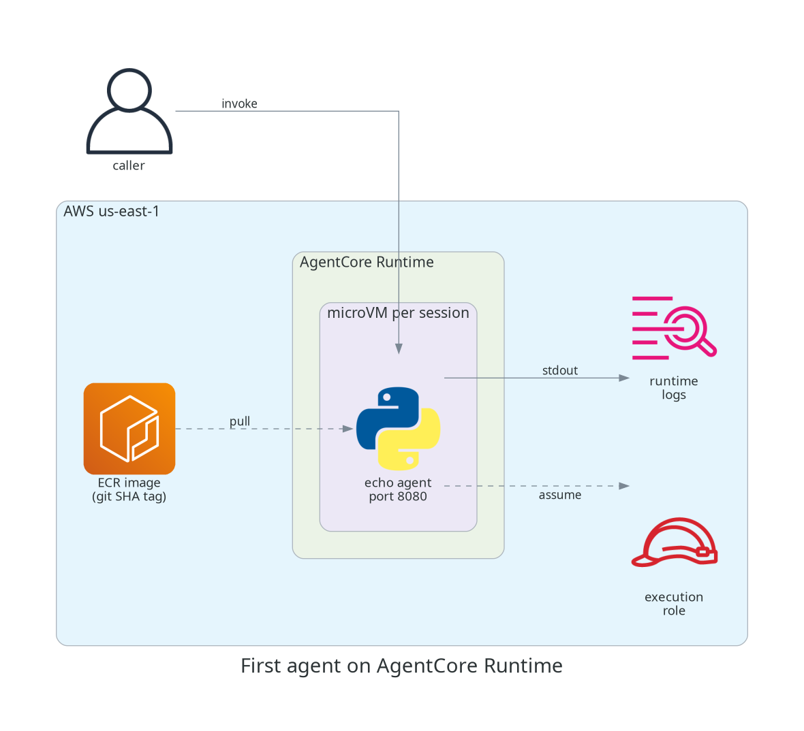

# What AgentCore actually is, and getting a first agent running on it

## TL;DR;

How to deploy an agent container to Amazon Bedrock AgentCore Runtime with
Terraform, invoke it, see what the platform gives you, and tear it down.

SOURCE CODE - All code for this post is available at:
https://github.com/levantar-ai/demos/tree/main/agentcore/01-first-agent

## Longer version

The gap between an agent that works in a notebook and an agent running in
production is not the agent loop, it is everything around it. You need
somewhere for it to run for potentially hours at a time, you need sessions
isolated from each other, you need to know who the agent is acting as when
it calls your APIs, and you need somewhere for the traces to go.

Amazon Bedrock AgentCore is AWS's answer to that operational shell, and it
is worth being clear about what it is not, because the name misleads in two
ways. It is not a framework, so you keep whatever you are already using
(Strands, LangGraph, CrewAI or your own loop). It is also not tied to
Bedrock models, because the runtime executes a container you give it and
that container can call whatever model it likes.

What you actually get is a set of managed services: Runtime for serverless
execution, Gateway for turning your APIs into MCP tools, Memory, Identity,
managed Browser and Code Interpreter tools, and observability on by
default. This series works through all of them, one post and one deployable
demo at a time, starting here with Runtime.

This is what we are deploying:



## 1 - The agent

The contract Runtime has with your container is small. Listen on port 8080,
answer `POST /invocations` with your agent logic, answer `GET /ping` with a
health response, and build for linux/arm64. There is no SDK requirement and
no blessed framework, which the demo agent proves by being about 40 lines
of Python standard library:

```python
class Handler(BaseHTTPRequestHandler):
    def do_GET(self):
        if self.path == "/ping":
            self._send(200, {"status": "healthy"})

    def do_POST(self):
        if self.path == "/invocations":
            payload = json.loads(self.rfile.read(length) or b"{}")
            self._send(200, {"result": f"echo: {payload.get('prompt', '')}"})
```

It just echoes the prompt back, which keeps the platform behaviour easy to
see. Later posts make it do something useful.

The Dockerfile is small, with one line that matters more than it looks:

```dockerfile
FROM python:3.12-slim
ENV PYTHONUNBUFFERED=1
WORKDIR /app
COPY main.py .
EXPOSE 8080
USER nobody
CMD ["python", "main.py"]
```

NOTE: `PYTHONUNBUFFERED=1` is what gets your `print()` output into
CloudWatch. Without it Python buffers stdout and your log streams stay
empty.

## 2 - The Terraform

The hashicorp/aws provider has native AgentCore support from v6, with a
family of `aws_bedrockagentcore_*` resources covering runtimes, gateways,
memory and the rest of the platform. The runtime is:

```hcl
resource "aws_bedrockagentcore_agent_runtime" "agent" {
  agent_runtime_name = "demos_agentcore_01_first_agent"
  role_arn           = aws_iam_role.runtime.arn

  agent_runtime_artifact {
    container_configuration {
      container_uri = "${aws_ecr_repository.agent.repository_url}:${var.image_tag}"
    }
  }

  network_configuration {
    network_mode = "PUBLIC"
  }

  protocol_configuration {
    server_protocol = "HTTP"
  }
}
```

NOTE: Runtime names are underscores only (`[a-zA-Z][a-zA-Z0-9_]*`), unlike
most AWS resources.

Alongside that there is an ECR repository with immutable tags, so deploys
reference a git SHA rather than latest, and an execution role the runtime
assumes to pull the image, write logs and call Bedrock models. Five
resources in total.

Build, push, apply:

```bash
docker buildx build --platform linux/arm64 -t "$REPO:$GIT_SHA" --push agent/
terraform apply -var="image_tag=$GIT_SHA"
```

The runtime creates in around 10 seconds and comes up READY. Describing it
with `aws bedrock-agentcore-control get-agent-runtime` shows a few things
you get without asking, a workload identity created automatically for the
runtime, session lifecycle defaults of 900 seconds idle and 8 hours
maximum, and built-in versioning where every image update bumps
`agentRuntimeVersion` automatically.

## 3 - Invoking it

```bash
aws bedrock-agentcore invoke-agent-runtime \
  --cli-binary-format raw-in-base64-out \
  --agent-runtime-arn "$RUNTIME_ARN" \
  --runtime-session-id "$SESSION_ID" \
  --payload '{"prompt": "hello"}' response.json

cat response.json
{"result": "echo: hello"}
```

NOTE: session IDs must be at least 33 characters, and the CLI needs
`--cli-binary-format raw-in-base64-out` or it will treat your JSON payload
as base64.

Here are four invocations across two sessions, timed:

| # | Session | Time | Observation |
|---|---------|------|-------------|
| 1 | A (new) | 6.89s | cold start, microVM spin up plus container boot |
| 2 | A (warm) | 1.35s | the session's microVM is alive and waiting |
| 3 | B (new) | 4.53s | a new session pays its own cold start |
| 4 | B (warm) | 1.27s | roughly 0.5s server-side once warm |

The third row is the one to understand. Runtime's isolation model is one
microVM per session, so a new session cannot reuse another session's warm
environment. The CloudWatch logs back this up, two sessions produce exactly
two `[runtime-logs]` streams in the runtime's log group, and the streams
also show the platform polling `GET /ping` between invocations, so
implement your health endpoint properly.

## 4 - Teardown

```bash
terraform destroy
```

All five resources destroy in about 20 seconds (set `force_delete` on the
ECR repository so the pushed images go with it). Runtime bills by consumed
CPU and memory seconds, so an exercise like this costs pennies.

## Conclusion

Runtime is a small surface to get started with. A 40 line stdlib Python
server and five Terraform resources gets you a deployed agent with
per-session microVM isolation that you can verify yourself in the timings
and the log streams.

What this post does not give you is a trustworthy path to production,
because this deploy ran from a laptop with admin credentials. The next post
wires this into CI with GitHub OIDC so there are no stored AWS keys, and a
pipeline where every demo in the repo gets tests, quality gates and
security scanning on every change.

References:

- https://github.com/levantar-ai/demos/tree/main/agentcore/01-first-agent
- https://docs.aws.amazon.com/bedrock-agentcore/
- https://registry.terraform.io/providers/hashicorp/aws/latest/docs/resources/bedrockagentcore_agent_runtime
