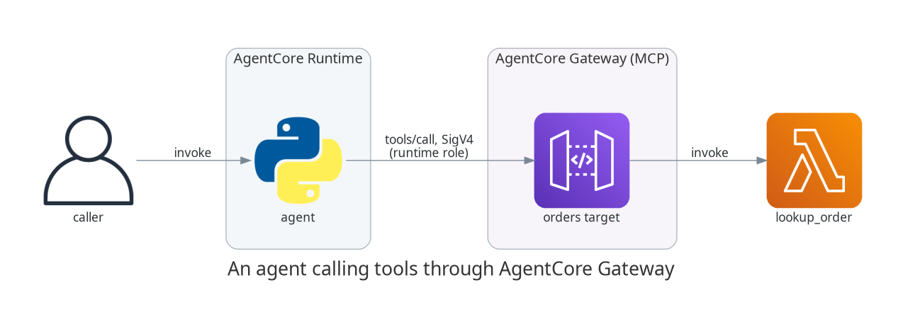

# Giving your agent tools with AgentCore Gateway

## TL;DR;

How to put AgentCore Gateway in front of an existing Lambda so an agent can
call it as an MCP tool, with Cognito issuing the tokens that get the agent
through the door.

SOURCE CODE - All code for this post is available at:
https://github.com/levantar-ai/demos/tree/main/agentcore/02-gateway

## Longer version

The agent from the first post could only echo. The way agents become useful
is tools, and the way tools have standardised is MCP. The problem is that
the systems agents need to reach, your internal APIs, your Lambdas, your
SaaS integrations, are not MCP servers and nobody wants to write and host a
fleet of them.

That is the job of AgentCore Gateway. You point it at things you already
have (Lambdas, OpenAPI specs, API Gateway stages) and it presents them to
agents as a single MCP server, handling the protocol, the auth and the tool
schemas. The agent sees a list of tools, the gateway routes each call to
the right backend.

This post puts a gateway in front of one Lambda, an order lookup, and has
the agent from post 01 answer order questions with it:



## 1 - The tool

The backend is a plain Lambda, no MCP anywhere in it. It takes an order id
and returns what it knows:

```python
ORDERS = {
    "42": {"status": "shipped", "carrier": "DPD", "eta": "2026-07-28"},
    "43": {"status": "picking", "carrier": None, "eta": "2026-07-30"},
    "44": {"status": "delivered", "carrier": "Royal Mail", "eta": None},
}


def handler(event, context):
    order_id = str(event.get("order_id", ""))
    order = ORDERS.get(order_id)
    if order is None:
        return {"error": f"order {order_id} not found"}
    return order
```

The gateway invokes it with the tool arguments as the event, so a Lambda
that already takes its inputs as top-level event fields and returns JSON
needs no changes. A Lambda written for another event shape, API Gateway
style `body` and `pathParameters` for example, would need an adapter.

## 2 - Auth in front of the gateway

The gateway supports three authorizer types, `CUSTOM_JWT`, `AWS_IAM` and
`NONE`, and you want a real one in front of anything beyond a throwaway
experiment. The simplest machine-to-machine setup is a Cognito user pool
with a resource server scope and a client-credentials app client, which
gives the agent a standard OAuth token endpoint to swap its client id and
secret for a JWT:

```hcl
resource "aws_cognito_resource_server" "gateway" {
  identifier   = "demos-gateway"
  name         = "gateway-tools"
  user_pool_id = aws_cognito_user_pool.gateway.id

  scope {
    scope_name        = "invoke"
    scope_description = "Invoke gateway tools"
  }
}

resource "aws_cognito_user_pool_client" "agent" {
  name         = "agent"
  user_pool_id = aws_cognito_user_pool.gateway.id

  generate_secret                      = true
  allowed_oauth_flows                  = ["client_credentials"]
  allowed_oauth_flows_user_pool_client = true
  allowed_oauth_scopes                 = ["demos-gateway/invoke"]
  supported_identity_providers         = ["COGNITO"]
}
```

The gateway validates tokens against the pool's OIDC discovery document,
an allow-list of client ids and the scope, so a token missing
`demos-gateway/invoke` is refused at the door.

## 3 - The gateway and its target

The gateway side is two resources, the gateway itself which is the MCP
endpoint plus the JWT authorizer, and a target which maps a backend into
the tool list:

```hcl
resource "aws_bedrockagentcore_gateway" "orders" {
  name            = "demos-agentcore-02-gateway-gw"
  role_arn        = aws_iam_role.gateway.arn
  protocol_type   = "MCP"
  authorizer_type = "CUSTOM_JWT"

  authorizer_configuration {
    custom_jwt_authorizer {
      discovery_url   = local.discovery_url
      allowed_clients = [aws_cognito_user_pool_client.agent.id]
      allowed_scopes  = [local.scope]
    }
  }
}

resource "aws_bedrockagentcore_gateway_target" "orders" {
  gateway_identifier = aws_bedrockagentcore_gateway.orders.gateway_id
  name               = "orders"

  credential_provider_configuration {
    gateway_iam_role {}
  }

  target_configuration {
    mcp {
      lambda {
        lambda_arn = aws_lambda_function.tool.arn

        tool_schema {
          inline_payload {
            name        = "lookup_order"
            description = "Look up the status of an order by its order id"

            input_schema {
              type = "object"

              property {
                name        = "order_id"
                type        = "string"
                description = "The order id to look up"
                required    = true
              }
            }
          }
        }
      }
    }
  }
}
```

The tool schema you declare here is what agents will see over MCP, so the
description matters, it is what a model uses to decide when to call the
tool.

Asking the gateway for its tool list shows the mapping in action:

```json
{
  "jsonrpc": "2.0",
  "id": 1,
  "result": {
    "tools": [
      {
        "name": "orders___lookup_order",
        "description": "Look up the status of an order by its order id",
        "inputSchema": {
          "type": "object",
          "properties": {
            "order_id": {
              "description": "The order id to look up",
              "type": "string"
            }
          },
          "required": ["order_id"]
        }
      }
    ]
  }
}
```

NOTE: the gateway namespaces tool names as `<target>___<tool>` (triple
underscore), so `lookup_order` on the `orders` target becomes
`orders___lookup_order`. Match on the suffix rather than hard-coding the
full name.

## 4 - Teaching the agent to call it

The agent gains two small functions, one to fetch a token and one to make
MCP calls, and the runtime passes the endpoints and credentials in as
environment variables from Terraform:

```python
def lookup_order(order_id):
    token = get_token()
    tools = mcp_request("tools/list", {}, token)["result"]["tools"]
    tool_name = next(t["name"] for t in tools if t["name"].endswith("___lookup_order"))
    result = mcp_request(
        "tools/call",
        {"name": tool_name, "arguments": {"order_id": order_id}},
        token,
    )
    return result["result"]["content"][0]["text"]
```

This is a minimal gateway-specific client, not a conforming MCP
implementation, it skips the MCP initialize handshake and assumes single
JSON responses rather than handling event streams. For a real agent use an
MCP SDK and this plumbing disappears.

```hcl
  environment_variables = {
    GATEWAY_URL           = aws_bedrockagentcore_gateway.orders.gateway_url
    COGNITO_TOKEN_URL     = local.token_url
    COGNITO_CLIENT_ID     = aws_cognito_user_pool_client.agent.id
    COGNITO_CLIENT_SECRET = aws_cognito_user_pool_client.agent.client_secret
    TOOL_SCOPE            = "demos-gateway/invoke"
  }
```

NOTE: the client secret passes through Terraform state and lands in the
runtime's environment, which is fine for a demo but in production means
encrypting and restricting the state backend and rotating the credential.

There is still no model in this agent, it extracts an order id from the
prompt with a regex, because the thing under demonstration is the tool
path, not the reasoning. A model slots into exactly this shape later in
the series.

## 5 - Asking it questions

```bash
aws bedrock-agentcore invoke-agent-runtime \
  --cli-binary-format raw-in-base64-out \
  --agent-runtime-arn "$RUNTIME_ARN" \
  --runtime-session-id "$SESSION_ID" \
  --payload '{"prompt": "where is order 42?"}' response.json

cat response.json
{"result": "order 42: {\"status\":\"shipped\",\"carrier\":\"DPD\",\"eta\":\"2026-07-28\"}"}
```

The full round trip, agent to token endpoint to gateway to Lambda and
back, came in at 2.74 seconds in one run on a fresh session including the
microVM cold start, and the tool handles the miss case the same way:

```
"is order 99 ok?"  ->  {"result": "order 99: {\"error\":\"order 99 not found\"}"}
```

## Conclusion

One Lambda, two gateway resources and a Cognito client turned a plain
function into an MCP tool an agent can discover and call, with JWT auth in
front of it and without writing or hosting an MCP server. The same target
mechanism scales sideways, more Lambdas, OpenAPI specs or API Gateway
stages all join the same tool list behind the same endpoint.

The next post gives the agent somewhere to keep what it learns, short-term
session context and long-term extracted memory with AgentCore Memory.

References:

- https://github.com/levantar-ai/demos/tree/main/agentcore/02-gateway
- https://docs.aws.amazon.com/bedrock-agentcore/
- https://registry.terraform.io/providers/hashicorp/aws/latest/docs/resources/bedrockagentcore_gateway
- https://modelcontextprotocol.io/
