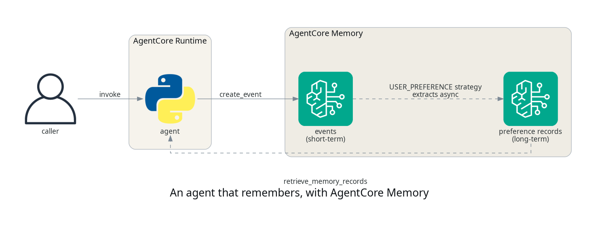

# Giving your agent memory that survives the session

## TL;DR;

How to add AgentCore Memory to an agent so it keeps short-term
conversation events within a session and recalls extracted user
preferences across sessions, with the extraction happening asynchronously
on the service side.

SOURCE CODE - All code for this post is available at:
https://github.com/levantar-ai/demos/tree/main/agentcore/03-memory

## Longer version

The agent from the first post forgets everything the moment a session
ends, which is what most agents do by default and what makes them feel
like strangers every time. Session state on its own does not fix this,
because the useful things a user tells you (their name, their
preferences, how they like to be contacted) belong to the user, not to
the session they happened to say them in.

AgentCore Memory splits this into two layers. Events are raw conversation
turns you write per actor and session, they expire after a configurable
number of days and behave as short-term memory. Strategies watch those
events and asynchronously extract structured records into namespaces,
which is the long-term memory that survives across sessions. The service
ships built-in strategies including semantic facts, summaries, user
preferences and episodic memory, plus custom strategies where you control
the extraction, and this post uses the user-preference one.



## 1 - The memory store

The memory side is two resources, the store itself with an expiry that
defines how long raw events live, and a strategy that tells the service
what to extract and where to put it:

```hcl
resource "aws_bedrockagentcore_memory" "agent" {
  name                  = "demos_agentcore_03_memory"
  event_expiry_duration = 7
}

resource "aws_bedrockagentcore_memory_strategy" "preferences" {
  memory_id  = aws_bedrockagentcore_memory.agent.id
  name       = "UserPreferences"
  type       = "USER_PREFERENCE"
  namespaces = ["/users/{actorId}"]
}
```

The namespace template is the interesting part. `{actorId}` is filled in
per actor at extraction time, so each user gets their own
`/users/<actor>` shelf of preference records, and the agent retrieves
from an actor-derived namespace.

NOTE: the actor id is not an authorization boundary. This demo trusts the
`actor` field in the request, which is fine for a demo, but a real
application must derive it from an authenticated identity, because
anything that can invoke the runtime can name any actor.

NOTE: the memory store is the slowest resource in this series so far to
create, 2m45s in this deployment, so create it once per environment and
keep it, rather than per deploy. Don't share one store across
environments or security boundaries though, stale records from one test
will happily turn up in the next.

## 2 - The agent

The agent from post 01 gains a cached boto3 client and three functions,
which is also this agent's first dependency, because memory is a
data-plane API rather than something the runtime injects:

```python
def remember(actor, session, text):
    client().create_event(
        memoryId=os.environ["MEMORY_ID"],
        actorId=actor,
        sessionId=session,
        eventTimestamp=datetime.now(timezone.utc),
        payload=[{"conversational": {"content": {"text": text}, "role": "USER"}}],
    )


def recap(actor, session):
    resp = client().list_events(
        memoryId=os.environ["MEMORY_ID"],
        actorId=actor,
        sessionId=session,
        maxResults=20,
    )
    return [
        p["conversational"]["content"]["text"]
        for e in resp.get("events", [])
        for p in e.get("payload", [])
        if "conversational" in p
    ]


def recall(actor, query):
    resp = client().retrieve_memory_records(
        memoryId=os.environ["MEMORY_ID"],
        namespace=f"/users/{actor}",
        searchCriteria={"searchQuery": query},
        maxResults=5,
    )
    return [r["content"]["text"] for r in resp.get("memoryRecordSummaries", [])]
```

Prompts starting with "remember" are stored as events, "recap" reads the
current session's events back, and anything else returns the matching
extracted preference records. The runtime role gets exactly those three
data-plane actions (CreateEvent, ListEvents, RetrieveMemoryRecords)
scoped to this one memory store, and Terraform passes the memory id in
as an environment variable.

## 3 - Teaching it something

The invoke command is the same `aws bedrock-agentcore invoke-agent-runtime`
call as post 01, so the examples below show just the payloads and
responses. Session A, actor `andy`:

```bash
--payload '{"actor": "andy", "session": "session-a",
            "prompt": "remember: my name is Andy and I always prefer DPD for deliveries"}'
{"result": "noted"}

--payload '{"actor": "andy", "session": "session-a",
            "prompt": "remember: I like order updates by email, never SMS"}'
{"result": "noted"}
```

The events land immediately and are the short-term layer, which the agent
reads back itself with "recap":

```bash
--payload '{"actor": "andy", "session": "session-a", "prompt": "recap"}'
{"result": ["remember: I like order updates by email, never SMS",
            "remember: my name is Andy and I always prefer DPD for deliveries"]}
```

## 4 - Asking from a different session

The same question from a new session, asked immediately and then again
once extraction had run. In this run the immediate answer was empty
because the extracted record did not exist yet, extraction is
asynchronous, so don't design against a fixed delay:

```bash
--payload '{"actor": "andy", "session": "session-b",
            "prompt": "which delivery carrier do I prefer?"}'
{"result": []}
```

The same payload, asked again once the strategy had done its work:

```bash
--payload '{"actor": "andy", "session": "session-b",
            "prompt": "which delivery carrier do I prefer?"}'
{"result": [
  "{\"context\":\"The user explicitly stated they always prefer DPD for deliveries.\",
    \"preference\":\"Always prefers DPD for deliveries\",
    \"categories\":[\"shopping\",\"delivery\"]}"
]}
```

The service turned a raw "remember:" sentence into a structured record
with the preference, the context it was stated in and categories, without
any extraction code on our side. In this run the record appeared
under a minute after the event it was extracted from.

NOTE: give a newly created strategy a few minutes before storing anything
you care about. In two separate deployments of this demo, events stored in
the first moments after the strategy was created, even with `get-memory`
already reporting it ACTIVE, were never extracted, while the same event
stored again once the strategy had settled was extracted in under a
minute. The missed events stay readable in short-term, they just never
become records.

That answer came from a different session to the one the preferences were
stored in, which is the whole point. The extracted records are attached
to the actor, not the session, so any future session for `andy` can
retrieve them.

## Conclusion

Memory in AgentCore is two deliberate layers rather than one magic box.
Events give you cheap, immediate, per-session recall with an expiry date,
and strategies turn those events into long-term records per user, ones
that survive session end and event expiry, without
you running any extraction pipeline yourself. The trade to design around
is the asynchronous gap between storing and recalling, an agent that
needs to use a fact in the same breath it learned it should read its own
session events, and lean on the extracted records for everything that
comes later.

The next post gives the agent the built-in tools, Code Interpreter and
Browser, and looks at the security model of letting an agent execute
code.

References:

- https://github.com/levantar-ai/demos/tree/main/agentcore/03-memory
- https://docs.aws.amazon.com/bedrock-agentcore/
- https://registry.terraform.io/providers/hashicorp/aws/latest/docs/resources/bedrockagentcore_memory
