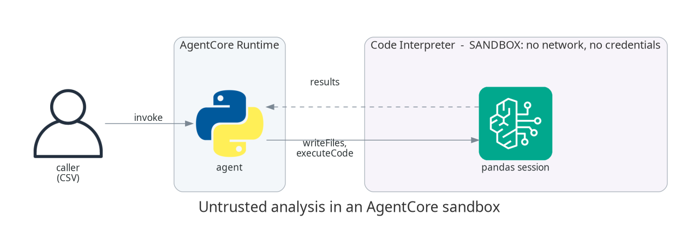

# Letting an agent run code, without letting it run loose

## TL;DR;

How to give an agent a real Python sandbox with AgentCore Code
Interpreter, so it can analyse data it was handed rather than guess at
it, and what the sandbox does and does not have access to.

SOURCE CODE - All code for this post is available at:
https://github.com/levantar-ai/demos/tree/main/agentcore/04-builtin-tools

## Longer version

Ask a language model to compute statistics over a few hundred rows and it
will produce numbers that look right. Give it somewhere to actually run
pandas and it produces numbers that are right. That is the whole argument
for code execution as a tool, and it is why every serious agent framework
ends up needing one.

The problem is where that execution happens. Parsing a stranger's CSV
with pandas inside your agent's own process puts a parser you did not
write, working on data you do not control, right next to your
credentials. Go a step further and execute model-generated code there and
the exposure is worse again.

AgentCore Code Interpreter is a managed sandbox for exactly this. Your
agent writes files into a session, runs code there, and reads results
back as text. This demo keeps the code fixed and author-written, so what
is being isolated is the *processing of untrusted data*, which is the
common case; the same mechanism is what you would use for
model-generated code, with more input and output controls on top. This
post wires one up and then pokes at the walls.



## 1 - The sandbox

One resource, and the network mode is the control that matters most:

```hcl
resource "aws_bedrockagentcore_code_interpreter" "sandbox" {
  name        = "demos_agentcore_04_interpreter"
  description = "Sandboxed pandas analysis for the demos series"

  network_configuration {
    network_mode = "SANDBOX"
  }
}
```

`SANDBOX` means the session gets no network access. The other option is
`PUBLIC`, which gives the sandbox outbound internet access, and you want
to be deliberate about choosing it, because that is the mode where a
malicious payload could exfiltrate whatever it can see.

NOTE: `SANDBOX` is the egress control, not the whole boundary. IAM
decides who can start and invoke a session, you decide what data goes
into one, and your agent decides what comes back out to the caller.
Isolating the network does not make everything in the session safe to
return.

The runtime role gets the three actions the agent actually calls, scoped
to this one sandbox:

```hcl
{
  Sid    = "CodeInterpreter"
  Effect = "Allow"
  Action = [
    "bedrock-agentcore:StartCodeInterpreterSession",
    "bedrock-agentcore:InvokeCodeInterpreter",
    "bedrock-agentcore:StopCodeInterpreterSession"
  ]
  Resource = aws_bedrockagentcore_code_interpreter.sandbox.code_interpreter_arn
}
```

## 2 - The agent

The agent's job is to move data in, run code, and read results out. It
never parses the CSV itself:

```python
def analyse(csv_text, session_id):
    interpreter = os.environ["CODE_INTERPRETER_ID"]
    call = client().invoke_code_interpreter
    call(
        codeInterpreterIdentifier=interpreter,
        sessionId=session_id,
        name="writeFiles",
        arguments={"content": [{"path": "data.csv", "text": csv_text}]},
    )
    return _text(
        call(
            codeInterpreterIdentifier=interpreter,
            sessionId=session_id,
            name="executeCode",
            arguments={"language": "python", "code": ANALYSIS},
        )
    )
```

`invoke_code_interpreter` takes a tool name and its arguments, the useful
ones being `writeFiles`, `executeCode`, `executeCommand`, `readFiles` and
`listFiles`. Responses arrive as an event stream, so there is a small
helper that drains every stream and raises when a tool sets `isError`,
which is easy to skip and then wonder why a failed run looks like a
successful empty one.

Sessions are the thing to be careful with. The agent stops its session in
a `finally` block, because a session lives until its timeout otherwise.

NOTE: files land in the session's working directory, not in `/tmp`. Write
to `data.csv` and read `data.csv`, and resist the urge to be clever with
absolute paths.

NOTE: sessions outlive the call that created them, up to
`sessionTimeoutSeconds`, and a sandbox with live sessions refuses to
delete (`ConflictException: ... cannot be deleted. There are 2 active
sessions`). I hit exactly that on the first teardown of this demo.

## 3 - Analysing something

Post a CSV to the agent and the numbers come back computed rather than
imagined:

```bash
--payload '{"csv": "order_id,items,total\n1001,3,42.50\n1002,1,12.00\n..."}'
```

```
order_id     items       total
count     5.000000  5.000000    5.000000
mean   1003.000000  3.600000   60.570000
std       1.581139  2.408319   48.863299
min    1001.000000  1.000000   12.000000
25%    1002.000000  2.000000   28.400000
50%    1003.000000  3.000000   42.500000
75%    1004.000000  5.000000   88.200000
max    1005.000000  7.000000  131.750000

rows: 5
```

Pandas is already installed in the sandbox image, as are the usual data
libraries, so there is no dependency management to do for straightforward
analysis.

## 4 - Testing the walls

The interesting part is what happens when code in the sandbox tries to
reach out. Running this inside a `SANDBOX` session:

```python
import urllib.request
urllib.request.urlopen("https://example.com", timeout=8)
```

```
blocked: URLError <urlopen error [Errno -2] Name or service not known>
```

No DNS, so nothing resolves. Checking for credentials in the environment
and for the metadata endpoint that would hand them over:

```python
keys = [k for k in os.environ if "AWS" in k or "TOKEN" in k]
urllib.request.urlopen("http://169.254.169.254/latest/meta-data/", timeout=5)
```

```
aws-ish env vars: []
metadata request denied: HTTP 401
```

No AWS- or token-named environment variables, and the metadata request
was denied rather than answered. Treat those as corroboration rather than
proof; the guarantee to design against is the documented `SANDBOX`
behaviour, which is that the session has no network egress. What you get
is code running on untrusted data somewhere it cannot phone home from.

## Conclusion

A managed sandbox turns "the model says the mean is about sixty" into a
computed answer, and it moves the processing of untrusted data off your
agent's microVM into a session with no network egress. One Terraform
resource, three IAM actions and a couple of API calls, with `SANDBOX` as
the egress control and IAM, session lifecycle and what you return to the
caller making up the rest of the boundary.

The next post gives the agent an identity of its own, inbound
authentication for callers and outbound OAuth so it can act on a user's
behalf.

References:

- https://github.com/levantar-ai/demos/tree/main/agentcore/04-builtin-tools
- https://docs.aws.amazon.com/bedrock-agentcore/latest/devguide/runtime-security-best-practices.html
- https://registry.terraform.io/providers/hashicorp/aws/latest/docs/resources/bedrockagentcore_code_interpreter
