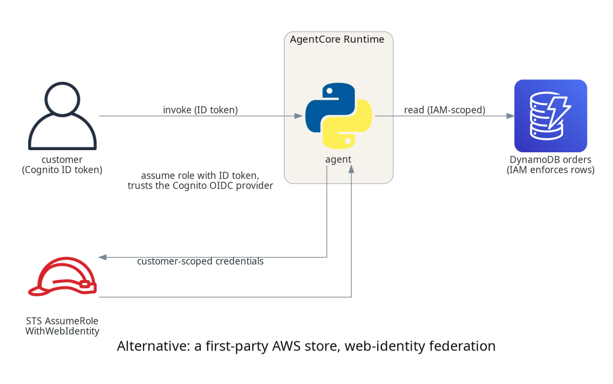
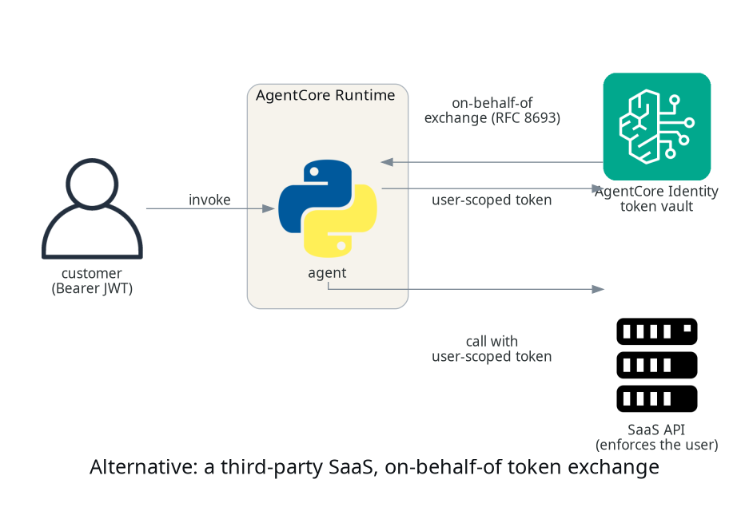

# Knowing who your agent is acting for, with AgentCore Identity

## TL;DR;

How to establish who a customer is on the way into an agent with AgentCore
Identity, and then enforce that identity on every invocation of the orders gateway tool
with Policy in AgentCore, so a Cedar policy at the gateway refuses any call
outside the caller's own orders, before the tool runs and outside the
agent's code.

> SOURCE CODE - All code for this post is available at:
> https://github.com/levantar-ai/demos/tree/main/agentcore/05-identity

## Longer version

This series is building one thing, the order support agent for Brightwell,
a small online retailer of outdoor kit that ships with DPD and Royal Mail.
Posts 01 to 04 gave it a runtime, a tool that looks orders up, memory and a
sandbox. None of them knew who was asking, and post 02 said so at the time,
that the gateway established a legitimate client was calling, not that it
was entitled to a particular order.

Closing that gap safely is the whole of this post, and it matters because
identity is where agent security is won or lost. The tempting fix, giving
the agent a broad credential and filtering results in its own code, is the
one AWS's Well-Architected Agentic AI Lens tells you not to reach for.

> The traditional approach of granting the agent broad credentials and
> relying on application-level filtering (such as adding WHERE clauses to
> queries) creates a single point of failure. A more resilient design moves
> authorization enforcement out of the agent's application code and into the
> infrastructure layer wherever possible.

That is [AGENTSEC03](https://docs.aws.amazon.com/wellarchitected/latest/agentic-ai-lens/agentsec03.html).
The reason it matters more for an agent than for ordinary code is the next
post, where a model, not deterministic code, chooses the arguments to a
tool. If the only thing keeping a caller to their own orders is the agent
passing the right id, a model that can be talked into passing a different
one has just read someone else's account.

So this post does two things. AgentCore Identity establishes the customer
on the way in, and Policy in AgentCore enforces that customer on the tool
behind the gateway. The enforcement point is deliberately not the agent.
The orders tool is the one behind the gateway, so it is the one this post
puts under Cedar; the memory and sandbox carried forward from posts 03 and
04 are called directly and are still scoped in the agent code, which is the
next thing you would move behind the same pattern.


## 1 - Inbound, the runtime and the gateway check the customer

The Cognito pool from post 02 keeps a public client for customers, who sign
in with a password and get an access token. The runtime validates that
token before the agent sees the request and forwards it. What is new is that
the gateway now validates the same customer token rather than a machine
token the agent obtained through AgentCore Identity:

```hcl
authorizer_configuration {
  custom_jwt_authorizer {
    discovery_url   = local.discovery_url
    allowed_clients = [aws_cognito_user_pool_client.customers.id]
  }
}
```

The access token this demo's sign-in produces carries `client_id` and
`username` but no `aud`, so the gateway validates it by `allowed_clients`
and no audience is set. The caller the gateway establishes from that token
is the customer, and their username is Brightwell's customer id. An ID token
puts the client in `aud` and carries no `client_id`, so the JWT authorizer
refuses it before the agent or Cedar sees it, which a live check confirmed
with `401 Claim 'client_id' value mismatch`. The handler's `token_use` check
is a second line behind that. That username is the identity the next section
authorizes against.

> NOTE: this is the same pool for customer accounts that Brightwell already
> controls. Only an admin creates users, so a username is a real customer id
> and not something an attacker can register. The policy matches on the
> `username`, while the Cedar principal is the immutable `sub`, so it also
> assumes Brightwell never reassigns a customer id to a different person; bind
> the data and the rule to `sub` if that assumption does not hold.
> `authorizer_type` is immutable, so a gateway that starts on the wrong
> client has to be replaced.

## 2 - The policy engine and the Cedar rules

Policy in AgentCore is a policy engine attached to the gateway. It holds
Cedar policies and evaluates them on every tool call. AWS states the model
plainly:

> For every tool invocation, the policy engine evaluates all applicable
> policies against the request to determine whether to allow or deny access.
> The engine enforces default-deny and forbid-wins semantics automatically.

That is from the
[Policy core concepts](https://docs.aws.amazon.com/bedrock-agentcore/latest/devguide/policy-core-concepts.html),
which also says where the principal and its attributes come from:

> When a AgentCore Gateway uses OAuth authorization, the principal is created
> from the JWT token's `sub` claim. OAuth principals support tags that
> contain JWT claims such as username, scope, role, etc.

So the caller's `sub` is the Cedar principal, the verified `username` claim
is a principal tag, and the tool's arguments arrive as `context.input`. A
`permit` expresses the allow, a customer may list only their own orders:

```hcl
resource "aws_bedrockagentcore_policy" "own_orders" {
  name             = "own_orders_only"
  policy_engine_id = aws_bedrockagentcore_policy_engine.orders.policy_engine_id

  definition {
    cedar {
      statement = <<-CEDAR
        permit(
          principal is AgentCore::OAuthUser,
          action == AgentCore::Action::"orders___list_orders",
          resource == AgentCore::Gateway::"${aws_bedrockagentcore_gateway.orders.gateway_arn}"
        ) when {
          principal.hasTag("username") &&
          principal.getTag("username") == context.input.customer_id
        };
      CEDAR
    }
  }
}
```

The `permit` only fires when the `customer_id` argument equals the caller's
own username. Because Cedar denies by default, a call for any other customer
matches no `permit` and is refused. The check is on the token's claim, which
the gateway verified, so it is not something the agent or a model can talk
its way around by choosing a different argument.

Cedar permits are additive, so a broad permit added in a later post could
otherwise re-open this. A `forbid`, which wins over any permit, keeps the
invariant for this action on this gateway, it denies a mismatched customer
id even if a later permit would match:

```hcl
forbid(
  principal is AgentCore::OAuthUser,
  action == AgentCore::Action::"orders___list_orders",
  resource == AgentCore::Gateway::"${aws_bedrockagentcore_gateway.orders.gateway_arn}"
) unless {
  principal.hasTag("username") &&
  principal.getTag("username") == context.input.customer_id
};
```

> NOTE: a tool-specific action must name a specific gateway resource, not a
> wildcard, or `CreatePolicy` refuses the statement. The gateway's role also
> needs the policy-engine read actions, scoped to the one engine, and the two
> evaluate actions, `AuthorizeAction` and `PartiallyAuthorizeActions`, which
> do not support resource-level scoping and so are granted on `*`. The
> gateway still evaluates only the engine its configuration points at.

## 3 - The agent carries the token, not a credential

Since post 02 the agent asked AgentCore Identity for a machine token to call
the gateway, through `GetResourceOauth2Token` against an OAuth2 credential
provider. That path and its provider are gone. The agent relays the
customer's own token, the one the runtime handed it, so it has no gateway
credential of its own:

```python
def list_orders(customer_id, customer_token):
    return asyncio.run(
        _call_tool("list_orders", {"customer_id": customer_id}, customer_token)
    )
```

This is the shape AWS's Well-Architected lens asks for, the user's identity
travelling as claims rather than the agent standing in for the user:

> When an agent acts on behalf of a user, the user context propagates as
> signed token claims through the call chain without the agent ever assuming
> the user's credentials.

Be precise about what this buys. The customer's token is still a credential,
a short-lived one for that customer, and the agent handles it, so treat it
as sensitive and never log or store it. What the gateway guarantees is that
the `customer_id` argument matches the identity in whatever token is
presented, so a model or agent that chooses a mismatched id is denied. It is
not a defence against an agent that has somehow obtained another customer's
token, that is a different threat handled by not leaking tokens in the first
place. Within its scope, the check holds even when the agent's own logic is
wrong, which is the point of moving it out of the agent.

## 4 - Running it

A customer signs in and calls the agent, and the happy path is unremarkable,
`list my orders` returns their orders. The interesting call is the one that
should not work. Asking the gateway directly, with a customer's own token,
for another customer's orders:

```bash
GATEWAY_URL=... TOKEN=<c-1000's token> python3 probe_gateway.py c-1000
# allowed: 7 orders for c-1000

GATEWAY_URL=... TOKEN=<c-1000's token> python3 probe_gateway.py c-1001
# denied by the gateway: Tool Execution Denied: Tool call not allowed due to
# policy enforcement [Policy evaluation denied due to deny_other_customers_orders].
```

The same token that reads c-1000's orders cannot read c-1001's, because the
Cedar policy has no `permit` for a `customer_id` that is not the caller's,
and default-deny does the rest. The agent's own logic did not have to be
correct for that call to be refused. This is what AWS means when it explains
why Policy in AgentCore sits at the gateway:

> Centralizing authorization outside both gives you a single checkpoint the
> LLM can't circumvent; one that's auditable and can be verified independently
> of the application code.

<!-- -->

> NOTE: the engine takes a `LOG_ONLY` mode that records what it would decide
> but lets the call run, so a denied call still returns the data. That is
> fail-open, useful only against synthetic data in an isolated account to
> confirm the principal, its tags and the decision look right before you turn
> on `ENFORCE`. It is not a safe preliminary against real customer data.
> This demo's Terraform carries a `policy_mode` variable, defaulting to
> `ENFORCE`.

## 5 - When it is not a gateway tool

Policy at the gateway is the answer when the tool is behind the gateway,
which is where this series has put its tools since post 02. Two other
shapes come up, and both keep authorization out of the agent.

For a first-party AWS store such as DynamoDB, you do not need a policy engine
at all. Register the Cognito pool as an IAM OIDC provider, take the
customer's ID token rather than the access token this demo uses, exchange it
for temporary credentials with STS `AssumeRoleWithWebIdentity`, and scope
those credentials to the customer. IAM does not filter arbitrary rows, so
the table has to be keyed on a stable identity from the token, the immutable
`sub`, with the role policy conditioning `dynamodb:LeadingKeys` on it. That
binding is in the signed token, so the agent cannot widen it. The role's
trust policy has to pin the issuer and the app client through the ID token's
`aud`, and its permissions have to leave out `Scan` and anything else
`LeadingKeys` cannot constrain. This is the shape, and it re-keys the data on
`sub` and changes the inbound token, so it is a different contract from this
post, not a drop-in.



For a third-party SaaS that IAM cannot reach, AgentCore Identity carries the
delegation itself, through on-behalf-of token exchange. The agent exchanges
the customer's inbound token for a user-scoped token the SaaS accepts, and
the SaaS enforces its own sharing rules. It needs a provider that supports
OAuth token exchange, RFC 8693 or the JWT-bearer profile RFC 7523, such as
Salesforce or Microsoft Entra, which Cognito is not. So it is the answer for
a third-party resource, not for a first-party Cognito tool.



## Conclusion

The agent now acts for a known customer, and for the orders tool it is the
infrastructure that keeps it there. AgentCore Identity establishes the
customer at the runtime and the gateway, Policy in AgentCore evaluates a
Cedar policy on every call to that tool, and a request for anyone else's
orders is denied by default before the tool runs. The agent has no gateway
credential of its own, and for that tool the choice of `customer_id` is no
longer the only thing standing between a caller and someone else's account.
The relay is still trusted to present the current caller's token, and the
memory and sandbox paths are still scoped in the agent, so moving those
behind the same gateway and policy is how you would finish the job.

That is the precondition for the next post, where a Bedrock model is handed
the tools this series has built and asked a question nobody wrote code for.
It will choose the arguments to those tools, including the customer id, and
the reason its orders access is safe is that the gateway, not the model,
decides whose orders come back.

References:

- https://github.com/levantar-ai/demos/tree/main/agentcore/05-identity
- https://docs.aws.amazon.com/wellarchitected/latest/agentic-ai-lens/agentsec02-bp01.html
- https://docs.aws.amazon.com/wellarchitected/latest/agentic-ai-lens/agentsec03.html
- https://docs.aws.amazon.com/bedrock-agentcore/latest/devguide/policy-core-concepts.html
- https://docs.aws.amazon.com/bedrock-agentcore/latest/devguide/policy-understanding-cedar.html
