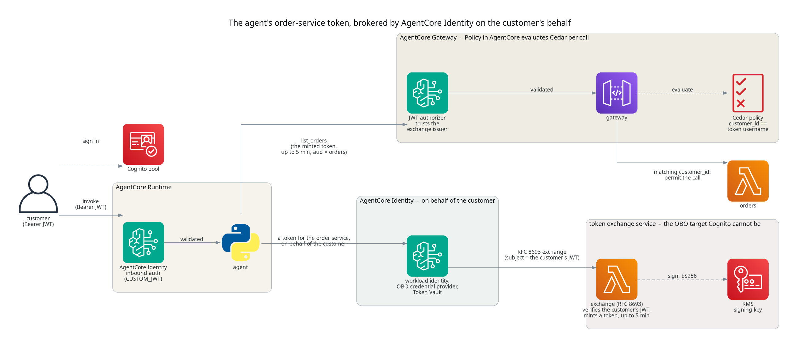
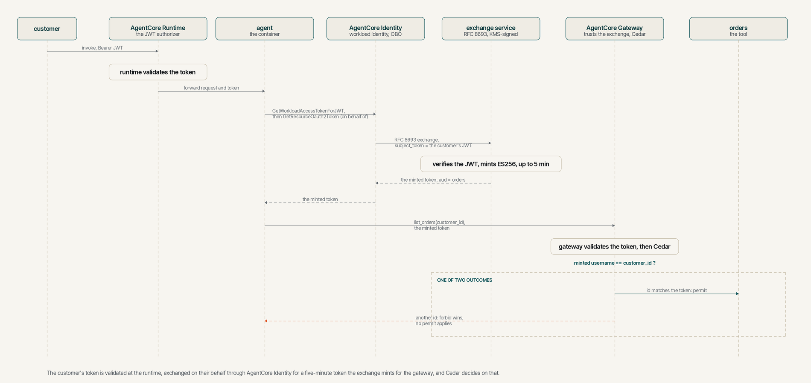

# Knowing who your agent is acting for, with AgentCore Identity

## TL;DR;

This post shows AgentCore Identity brokering an on-behalf-of exchange, from
the token a customer signed in with to a token for the order service that a
separate RFC 8693 issuer mints. The runtime validates the customer's
credential and forwards it to the agent, the agent passes it to AgentCore
Identity, and AgentCore Identity presents it to the issuer. The gateway sees
only the minted token, the tool only the arguments Cedar permitted, and a
Cedar policy at the gateway refuses any call whose customer differs from the
token presented. Cognito does not implement that exchange grant, so a small
self-hosted issuer stands in for the managed IdP you would use in production.

> SOURCE CODE - All code for this post is available at:
> https://github.com/levantar-ai/demos/tree/main/agentcore/05-identity

**The token-exchange service in this post is a teaching component, not
production-grade. It exists to show the AgentCore Identity integration. In
production the exchange is done by a managed IdP that supports the grant.**

## Longer version

This series is building one thing, the order support agent for Brightwell,
a small online retailer of outdoor kit that ships with DPD and Royal Mail.
Posts 01 to 04 gave it a runtime, a tool that looks orders up, memory and a
sandbox. None of them knew who was asking, and post 02 said so at the time,
that the gateway established a legitimate client was calling, not that it
was entitled to a particular order.

Closing that gap is the whole of this post, and it matters because
filtering in the agent's own code is not an authorisation boundary. The
tempting fix, giving the agent a
broad credential and filtering results in its own code, is the one AWS's
Well-Architected Agentic AI Lens tells you not to reach for.

> The traditional approach of granting the agent broad credentials and
> relying on application-level filtering (such as adding WHERE clauses to
> queries) creates a single point of failure. A more resilient design moves
> authorization enforcement out of the agent's application code and into the
> infrastructure layer wherever possible.

https://docs.aws.amazon.com/wellarchitected/latest/agentic-ai-lens/agentsec03.html

AgentCore Identity has two halves. Inbound Auth validates the token a caller
presents to a runtime or a gateway. Outbound Auth gives the agent tokens for
the things it calls, through a workload identity, credential providers and a
token vault. Relaying the customer's Cognito token to the gateway uses only
the inbound half, and is a sound pattern for a first-party tool, but it
provisions no AgentCore Identity resource at all. This design uses both
halves. The agent asks AgentCore Identity for a token for the order service, on
behalf of the customer, and AgentCore Identity brokers an exchange of the
customer's inbound token for one that a separate issuer mints. That is the
on-behalf-of flow. It suits a background agent because, where the provider
has already established the delegation, no further interactive consent is
asked for on each downstream call. This demo's issuer applies a fixed
first-party policy and has no consent screen at all.



## 1 - Inbound, the runtime checks the customer

The Cognito pool from post 02 keeps a public client for customers, who sign
in with a password and get an access token. The runtime validates that token
before the agent sees the request, through AgentCore Identity's inbound auth,
which is the `CUSTOM_JWT` authorizer on the runtime.

```hcl
authorizer_configuration {
  custom_jwt_authorizer {
    discovery_url   = local.discovery_url
    allowed_clients = [aws_cognito_user_pool_client.customers.id]
  }
}
```

AWS describes configuring the runtime this way as implementing authentication
"using OAuth and JWT bearer tokens with AgentCore Identity", Inbound Auth
being its name for the half that validates callers.

> This section shows you how to implement authentication and authorization
> for your agent runtime using OAuth and JWT bearer tokens with AgentCore
> Identity. You'll learn how to set up Cognito user pools, configure your
> agent runtime for JWT authentication (Inbound Auth), and implement
> OAuth-based access to third-party resources (outbound Auth).

https://docs.aws.amazon.com/bedrock-agentcore/latest/devguide/runtime-oauth.html

The `Authorization` header is on the runtime's request header allowlist, so
the agent receives the validated token. It reads the `username` claim as the
customer, refuses anything that is not an access token, and never takes the
customer from the request body. This part is not where the post's subject
lives.

> NOTE: the runtime's authorizer is built to accept an end user's token, so in
> a real system the customer's own app, or a backend for it, would invoke the
> runtime carrying that token. This demo has the customer call the runtime
> directly, which changes nothing about the token or the checks and keeps
> the subject on the identity mechanism rather than the application wiring.

## 2 - On behalf of the customer, the agent's token comes from AgentCore Identity

Here is the change. The agent does not send the customer's Cognito token to
the gateway. It asks AgentCore Identity for a token for the order service,
and AgentCore Identity brokers the exchange on the customer's behalf, with
the issuer in the next section doing the minting. AWS's description of the
flow is exactly the property wanted.

> Amazon Bedrock AgentCore Identity supports On-Behalf-Of (OBO) token
> exchange, enabling agents and other workloads—such as MCP servers—to
> exchange an inbound user access token for a new, scoped access token that
> targets a downstream resource server. As the exchange converts a token
> issued for one audience directly into a token for a different downstream
> audience, your agents can access protected resources on behalf of
> authenticated users without triggering additional consent flows.

https://docs.aws.amazon.com/bedrock-agentcore/latest/devguide/on-behalf-of-token-exchange.html

Two calls do it. The first turns the customer's inbound token into a workload
access token, which represents the agent acting for that customer. The second
uses it to request the resource token, and AgentCore Identity brokers the
exchange with the credential provider.

```python
workload_token = client.get_workload_access_token_for_jwt(
    workloadName=os.environ["WORKLOAD_NAME"],
    userToken=inbound_jwt,
)["workloadAccessToken"]

result = client.get_resource_oauth2_token(
    workloadIdentityToken=workload_token,
    resourceCredentialProviderName=os.environ["OBO_PROVIDER_NAME"],
    scopes=[os.environ["ORDERS_SCOPE"]],
    oauth2Flow="ON_BEHALF_OF_TOKEN_EXCHANGE",
)
```

Three AgentCore Identity resources sit behind that. A workload identity for
the agent, declared explicitly so its name is known when the runtime is
created. A credential provider configured for on-behalf-of exchange, which
authenticates the exchange with a client credential. And the token vault,
which the provider lives under. The client credential itself ends up in
three places, a Secrets Manager secret AgentCore Identity manages for the
provider, a second Secrets Manager secret the exchange Lambda validates
against, and the Terraform state that generated it, which is a reason to
keep that state encrypted and tightly controlled.

```hcl
resource "aws_bedrockagentcore_workload_identity" "agent" {
  name = "demos_agentcore_05_agent"
}

resource "aws_cloudcontrolapi_resource" "obo_provider" {
  type_name = "AWS::BedrockAgentCore::OAuth2CredentialProvider"
  desired_state = jsonencode({
    Name                     = "demos_agentcore_05_obo"
    CredentialProviderVendor = "CustomOauth2"
    Oauth2ProviderConfigInput = {
      CustomOauth2ProviderConfig = {
        OauthDiscovery             = { DiscoveryUrl = "${local.exchange_issuer}/.well-known/openid-configuration" }
        ClientId                   = local.exchange_client_id
        ClientSecret               = random_password.exchange_client_secret.result
        ClientAuthenticationMethod = "CLIENT_SECRET_BASIC"
        OnBehalfOfTokenExchangeConfig = {
          GrantType                    = "TOKEN_EXCHANGE"
          TokenExchangeGrantTypeConfig = { ActorTokenContent = "NONE" }
        }
      }
    }
  })
}
```

> NOTE: the provider is created through Cloud Control rather than
> `aws_bedrockagentcore_oauth2_credential_provider`, because that resource in
> the AWS provider, as of 6.64, does not model
> `on_behalf_of_token_exchange_config`. The CloudFormation type does.

> NOTE: `GetResourceOauth2Token` reads the provider's client secret in the
> caller's context, so the runtime role needs `secretsmanager:GetSecretValue`
> on the secret AgentCore Identity manages for the provider, named
> `bedrock-agentcore-identity!default/oauth2/<provider>-…`. Without it the
> first call fails with an access-denied on that secret.

## 3 - The exchange service, the target Cognito cannot be

On-behalf-of exchange is RFC 8693, and it needs an authorisation server that
implements that grant. Cognito does not. Its token endpoint accepts exactly
three grant types.

> Must be `authorization_code` or `refresh_token` or `client_credentials`.

https://docs.aws.amazon.com/cognito/latest/developerguide/token-endpoint.html

So the demo keeps Cognito for the customer's login and stands up a small
exchange service as the target, one Lambda behind an HTTP API. It stands in
for the managed on-behalf-of provider you would use in production. AgentCore
Identity supports Microsoft Entra ID through its own provider-specific
on-behalf-of integration, and an RFC 8693 IdP through the custom OAuth2
provider once verified against that contract. The service is here to show
the AgentCore Identity integration, not because running your own issuer is
the recommendation.

The service receives the customer's Cognito token as the `subject_token`,
authenticated by the provider's client secret, and validates it strictly
against the pool's keys, the issuer, the expiry, the `token_use` and the
client id. Then it mints a new token signed with a KMS asymmetric key, ES256,
carrying the verified `username`, an audience of the order gateway, the
`orders/read` scope, and an expiry of five minutes or the remaining life of
the customer's token, whichever is shorter. The audience and scope are
fixed by configuration and the identity claims come only from the validated
subject token; no other request parameter can choose or widen them.

The security of that service is the security of the whole design, so be
precise about it. KMS keeps the private key from ever leaving KMS, and the
Lambda's role can call `Sign` and `GetPublicKey` on that one key with no key
administration permissions. What KMS does not do
is stop this code, once it is trusted, signing a token for any customer. If
the exchange service or its role is compromised, every customer identity is
compromised, which is the reason to use a managed IdP rather than run one.
The `act` claim in the minted token names the registered client, not the
agent workload, because with `ActorTokenContent = NONE` the exchange
authenticates a client secret and knows nothing more about who is calling.
And it has no key rollover. It publishes one verification key, whereas a
production issuer publishes the old and the new for an overlap covering the
token lifetime and the verifiers' caching, which is one more thing the
managed IdP does for you.

## 4 - The gateway trusts the exchange, and Cedar still decides

The gateway's authorizer is pointed at the exchange service rather than at
Cognito. The access token this demo's Cognito client issues has no `aud`,
whereas the minted token carries `aud = brightwell-orders`, so the gateway
validates by `allowed_audience`.

```hcl
authorizer_configuration {
  custom_jwt_authorizer {
    discovery_url    = "${local.exchange_issuer}/.well-known/openid-configuration"
    allowed_audience = [local.orders_audience]
  }
}
```

That has a consequence worth stating plainly. The gateway is configured for
the exchange issuer and that audience, so this stack's Cognito token is not
accepted at the gateway at all, and relaying it is not a weaker option the
agent might fall back to, it does not work. Be equally plain about the
converse. The gateway accepts any correctly signed token from that issuer
with that audience and cannot tell whether AgentCore Identity brokered it.
The normal agent path obtains it through AgentCore Identity, but `/token` is
also callable directly by anyone holding the provider's client secret and a
valid Cognito token, and the runtime role can read that secret, because
`GetResourceOauth2Token` reads it in the caller's context. A direct caller
still needs a customer's valid token to be issued that customer's identity,
so this does not let one customer become another, but the `act` claim proves
only which client credential was used.

> NOTE: the gateway fetches the discovery document when it is created and
> parses it as OpenID Connect, which requires `authorization_endpoint` and
> the other OIDC provider fields. An exchange-only issuer still has to
> advertise them, or the gateway fails to create with `Failed to fetch
> discovery document`, so this issuer's document is a compatibility shim
> that names capabilities it does not implement. One more reason it is a
> teaching component and not a production issuer.

Per-customer enforcement is the Policy in AgentCore engine from the first
version, unchanged, evaluating a Cedar policy on every tool call.

> For every tool invocation, the policy engine evaluates all applicable
> policies against the request to determine whether to allow or deny access.
> The engine enforces default-deny and forbid-wins semantics automatically.

> When a AgentCore Gateway uses OAuth authorization, the principal is
> created from the JWT token's `sub` claim. OAuth principals support tags
> that contain JWT claims such as username, scope, role, etc.

https://docs.aws.amazon.com/bedrock-agentcore/latest/devguide/policy-core-concepts.html

The minted token's `username` becomes a principal tag, and the rule is the
one line it always was.

```hcl
permit(
  principal is AgentCore::OAuthUser,
  action == AgentCore::Action::"orders___list_orders",
  resource == AgentCore::Gateway::"${aws_bedrockagentcore_gateway.orders.gateway_arn}"
) when {
  principal.hasTag("username") &&
  principal.getTag("username") == context.input.customer_id
};
```

A matching `forbid` guards it, so a broad permit added in a later post cannot
widen it, forbid winning over any permit.

> NOTE: the engine validates a policy's action against the gateway target's
> tool schema, so the permit must be created after the target, and a forbid
> validated before any permit exists is refused as overly restrictive, so it
> must be created after the permit. Both are `depends_on` in the config.

## 5 - Running it

The whole path. The runtime validates the customer's Cognito token, the
exchange issuer validates it again during the exchange, and the gateway
validates the minted token before Cedar evaluates the call.



A customer signs in and calls the agent, and the happy path looks like every
earlier post, because the exchange happens inside it.

```bash
$ curl "$INVOKE_URL" -H "Authorization: Bearer $TOKEN" \
    -H "Content-Type: application/json" \
    -H "X-Amzn-Bedrock-AgentCore-Runtime-Session-Id: $SESSION" \
    -d '{"prompt": "list my orders"}'
{"result": {"customer_id": "c-1000", "orders": [{"order_id": 1033, ...}, ...]}}
```

The token that reached the gateway is worth looking at. Exchanging c-1000's
Cognito token at the service directly, to inspect the result, gives this.

```
header  {"alg": "ES256", "typ": "JWT", "kid": "emymRDGf8v466M6hq75KAmkU99TbImBeNM7I1oeCrSg"}
claims  iss      https://kc5n0arhqc.execute-api.us-east-1.amazonaws.com
        aud      brightwell-orders
        username c-1000
        scope    orders/read
        act      {"client_id": "brightwell-orders-agent"}
        exp-iat  300 seconds
```

Compared with relaying the Cognito token, this one is audience-restricted to
the order gateway, expires after at most five minutes, and the customer's
credential itself never reaches the gateway or the tool.

The interesting calls are the ones that should not work, made against the
gateway directly with that minted token.

```bash
$ TOKEN="$MINTED" python3 probe_gateway.py c-1000
allowed: 7 orders for c-1000

$ TOKEN="$MINTED" python3 probe_gateway.py c-1001
denied by the gateway: Tool Execution Denied: Tool call not allowed due to
policy enforcement [Policy evaluation denied due to deny_other_customers_orders]

$ TOKEN="$COGNITO" python3 probe_gateway.py c-1000
error (not a policy decision) for c-1000: Client error '403 Forbidden'
```

The second is Cedar refusing another customer's orders on the minted token's
`username`, before the tool runs. The third is the customer's raw Cognito
token being refused outright, the gateway no longer trusts that issuer. A
token with one character altered gets the same 403, and at the exchange
service a wrong client secret, a widened scope, a different audience or an
unsigned subject token are each refused before anything is minted.

## 6 - What it does not solve, and the alternatives

Be precise about what this buys. The gateway sees a short-lived,
audience-restricted token minted for this customer rather than the
customer's own credential. Cedar then prevents a model-chosen or accidental
`customer_id` from mismatching the token that was presented. What it does
not do is prove the agent used the current invocation's token. Cedar binds
`customer_id` to the `username` in whichever valid minted token arrives, so
a compromised agent serving many customers could reuse another customer's
token it had seen earlier and be permitted for that customer. It cannot
invent a customer it holds no valid token for. Stronger isolation means
performing the exchange in a trusted per-request component outside the
agent's code, or isolating workloads per tenant. It is still a bearer token,
so a stolen minted token is usable until it expires, and a stolen Cognito
token can still call the runtime and cause fresh exchanges until it expires.
The `scope` claim is carried, not enforced, because the Cedar policy checks
the customer and not the scope; the audience is what the gateway enforces.
And Cedar constrains the call, not the rows. It refuses a `list_orders` whose
requested customer differs from the token, but it cannot see what the Lambda
returns, so the order service must still select only that customer's rows.
Here it does, and a test proves it, but that is code again, and where the
data layer can enforce the tenant key it should.

There are other shapes, and they fit other backends. For a customer's own
data at a third-party SaaS, the user-delegated flow with a consent screen is
the natural one, and AgentCore Identity's credential providers handle it,
but a consent screen is not a normal thing to put in front of a customer
asking a first-party shop about its own orders, which is why this post did
not use it. For a first-party AWS store such as DynamoDB, federating the
customer to IAM with `AssumeRoleWithWebIdentity` can put the row enforcement
in IAM. That takes a token made for federation, not this post's access
token, which has no `aud`. With the user pool registered as an IAM OIDC
provider, the customer's ID token is the one to present, the role's trust
policy checks its app-client audience, and the role's permissions pin the
partition key to the federated identity (`dynamodb:LeadingKeys`). The
federation alone enforces nothing. For a workforce agent, IAM Identity Center's trusted identity
propagation carries an employee's identity through the AWS applications and
services that support it. And for
production, the exchange in this post is done by an IdP that supports the
grant. AgentCore Identity documents Microsoft Entra ID and a custom OAuth2
configuration for this; other IdPs are candidates once their RFC 8693
implementation is verified against that custom-provider contract. That is
also what removes the issuer you would otherwise be running yourself.

For the orders tool the design implements the Well-Architected lens on tool
authorisation, the gateway and its policy engine authorising every invocation
against a declarative policy before the Lambda runs, and it propagates the
customer's identity to that enforcement point as claims in a token minted for
the purpose rather than giving the agent broad access.

https://docs.aws.amazon.com/wellarchitected/latest/agentic-ai-lens/agentsec02.html

## Conclusion

The agent now acts for a known customer with a token brokered by AgentCore
Identity and minted for the purpose. Inbound auth establishes who the
customer is, the on-behalf-of exchange gives the agent a token for the order
service that is audience-restricted, short-lived and not the customer's own
credential, carrying an `orders/read` scope claim this demo does not
enforce, and Policy in AgentCore refuses a call for anyone but the customer
named in that token before the tool runs. The gateway accepts no static
agent credential, and the customer's token is refused there even if relayed
by mistake. What is not bound is the token to the invocation; a compromised
agent serving many customers could present another customer's still-valid
token and be permitted for them. The memory and sandbox paths are still
isolated in the agent's own code, so moving those behind the same gateway
and policy is how you would finish the job, and in production the exchange
belongs to a managed IdP rather than a Lambda you run.

That is the precondition for the next post, where a model is handed the
tools this series has built and chooses the arguments, including the
customer id. Provided the model chooses the argument and not the token, which
trusted code supplies, a wrong choice is refused at the gateway rather than
read from someone else's account.

References:

- https://github.com/levantar-ai/demos/tree/main/agentcore/05-identity
- https://docs.aws.amazon.com/bedrock-agentcore/latest/devguide/on-behalf-of-token-exchange.html
- https://docs.aws.amazon.com/bedrock-agentcore/latest/devguide/runtime-oauth.html
- https://docs.aws.amazon.com/bedrock-agentcore/latest/devguide/policy-core-concepts.html
- https://docs.aws.amazon.com/cognito/latest/developerguide/token-endpoint.html
- https://docs.aws.amazon.com/wellarchitected/latest/agentic-ai-lens/agentsec02.html
- https://docs.aws.amazon.com/wellarchitected/latest/agentic-ai-lens/agentsec03.html
- https://datatracker.ietf.org/doc/html/rfc8693
